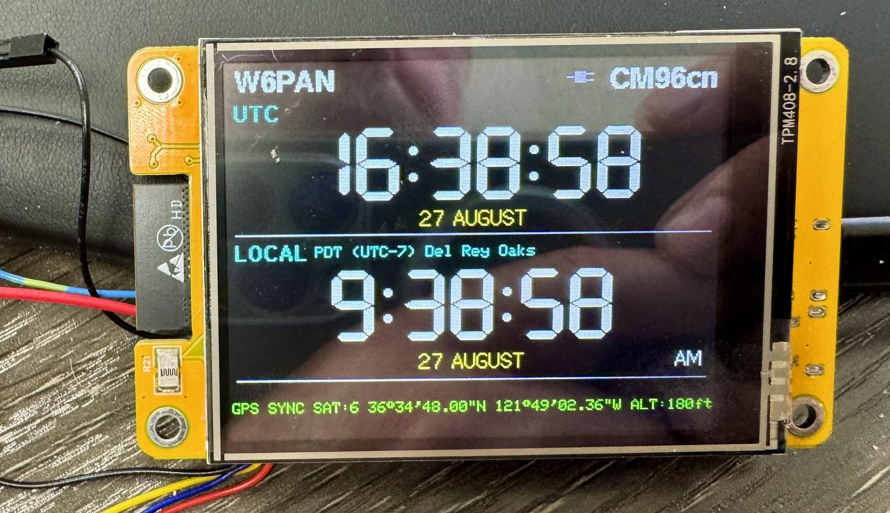

# Self-Setting UTC/Local Time Offline GPS Ham Clock



An internet-independent UTC and local-time clock built around the inexpensive
ESP32-2432S028 2.8-inch touchscreen board, commonly called the Cheap Yellow
Display or CYD. A GPS/GNSS receiver supplies UTC, position, altitude, satellite
count, and a one-pulse-per-second timing signal. Large offline databases on the
microSD card convert the current coordinates into civil time, daylight-saving
rules, a nearby place name, a Maidenhead locator, and named marine geography.

The clock was designed as a portable reference for amateur-radio operating, but
it is equally useful anywhere an accurate UTC/local display must work without
Wi-Fi, NTP, cellular service, cloud APIs, or online geocoding.

## Current release

**`GPSClock_v12`** is the first public release
candidate. It has been compiled and hardware-tested on an ESP32-2432S028 using
ESP32 Arduino Core 3.3.11.

## Features

### Time and positioning

- GPS-derived UTC with PPS-assisted clock synchronization.
- UTC and local civil time displayed simultaneously.
- Automatic daylight-saving changes and UTC offsets from offline IANA rules.
- Worldwide civil-timezone lookup from GPS coordinates.
- Longitude-based nautical timezone fallback outside civil-timezone polygons.
- Six-character Maidenhead grid locator.
- Latitude/longitude in decimal degrees or degrees/minutes/seconds.
- Satellite count and GNSS altitude display.
- Manual local date/time entry when GPS time is unavailable.

### Offline geographic context

- Worldwide place-name lookup from more than five million GeoNames records.
- Ranked locality selection that balances distance, feature type, and population.
- Named ocean, sea, gulf, bay, sound, and other marine-area lookup.
- Automatic geographic re-resolution after meaningful movement.
- Cached last-known position and geography during temporary reception loss.
- No network connection or online API required at runtime.

### GPS management

- Three mutually consistent fixes with at least four satellites are required
  before accepting a new position.
- A 100 m maximum step between stable-fix samples rejects wandering fixes.
- Normal GPS resynchronization approximately every 30 minutes.
- Up to 120 seconds per acquisition attempt.
- Two-minute retry after an unsuccessful acquisition.
- N/F hardware control lets the ESP32 place the receiver in standby.

### Display and controls

- 320x240 color touchscreen interface.
- Fixed-width seven-segment time rendering without shifting digits.
- Cached date and AM/PM fields to avoid once-per-second flicker.
- Dark and light display themes.
- Red/black Night Mode with `AUTO`, `ON`, and `OFF` choices.
- AUTO Night Mode uses the CYD R21 ambient-light sensor with hysteresis and a
  five-confirmation filter; saved start/end times remain the invalid-sensor
  fallback.
- Four persistent backlight levels: 25%, 50%, 75%, and 100%.
- Touch-editable callsign supporting `A-Z`, `0-9`, and `/`.
- Large two-column Options grid designed for resistive-touch accuracy.
- Visual alarm with nine-minute snooze and two-minute timeout.
- Preferences survive normal firmware uploads and power cycles.

## Hardware

The tested reference build uses:

- ESP32-2432S028 CYD with ILI9341 display, XPT2046 touch, R21 light sensor,
  and onboard microSD slot.
- GP-02 GPS/GNSS receiver with NMEA TX, PPS, and N/F control.
- FAT32 microSD card with at least 512 MB usable capacity; 1 GB or larger is
  recommended for comfortable free space. The current database set is about
  213 MB.
- Stable 5 V USB power and a data-capable USB cable for programming.

See the [hardware BOM](docs/BOM.md) and
[hardware assembly guide](docs/HARDWARE_BUILD.md) before connecting anything.

## Repository layout

```text
firmware/GPSClock_v12_options_grid/  Modular Arduino sketch
config/                              TFT_eSPI CYD setup
tools/                               Database builders and validation tools
source/                              User-supplied datasets; not committed
output/                              Generated databases; not committed
data/                                SD layout and data-license guidance
docs/                                Build, operation, licensing, and release docs
```

## Required microSD layout

```text
/
├── timezone/
│   ├── index.bin
│   ├── zones.bin
│   ├── tiles.bin
│   └── rules.bin
├── places/
│   ├── places.bin
│   └── places_index.bin
└── marine/
    └── marine.bin
```

The generated files are not stored in normal Git history. `places.bin` alone is
larger than GitHub's regular file limit. Publish a properly attributed SD-data
ZIP as a GitHub Release asset or rebuild the databases using the supplied tools.

## Build and use

1. Read [Hardware build](docs/HARDWARE_BUILD.md).
2. Prepare the offline data using [Data build](docs/DATA_BUILD.md), or obtain a
   matching attributed data release.
3. Configure and upload the firmware using
   [Firmware build](docs/FIRMWARE_BUILD.md).
4. Follow the [User guide](docs/USER_GUIDE.md) for first fix and operation.

## Future Features

- A purpose-built enclosure for the CYD, GPS receiver, wiring, and future power
  components, while retaining access to USB, microSD, and the R21 light sensor.
- Rechargeable battery operation for portable and backup use.
- A compatible charging and power-management board for safely charging the
  battery and powering the clock.
- Speaker support using the CYD's onboard audio amplifier, with alarm sounds
  loaded from user-selectable audio files on the microSD card.

These are planned enhancements and are not part of the tested v12 reference
build. The battery type, charging board, protection, power-path arrangement,
runtime, enclosure design, speaker specification, and supported audio-file
formats still need to be selected and validated.

## Project photos

| View | Photo |
|---|---|
| Main clock, dark theme, 12-hour local time (lead image) | [View](images/gps-clock-lead-dark-theme.jpg) |
| Main clock, dark theme, 24-hour local time | [View](images/main-clock-dark-theme-24-hour.jpg) |
| Main clock, light theme, 12-hour local time | [View](images/main-clock-light-theme-12-hour.jpg) |
| Main clock, light theme, 24-hour local time | [View](images/main-clock-light-theme-24-hour.jpg) |
| Night-vision-safe red mode | [View](images/night-vision-safe-mode.jpg) |
| Options, dark theme | [View](images/options-screen-dark-theme.jpg) |
| Options, light theme | [View](images/options-screen-light-theme.jpg) |
| Night Mode settings | [View](images/night-mode-settings-screen.jpg) |
| Alarm settings | [View](images/alarm-settings-screen.jpg) |
| Callsign editor | [View](images/callsign-editor-screen.jpg) |
| Manual date/time screen | [View](images/manual-date-time-screen.jpg) |
| CYD rear board and GPS wiring | [View](images/cyd-rear-board-and-gps-wiring.jpg) |
| GP-02 GPS module wiring | [View](images/gp-02-gps-module-wiring.jpg) |

## Tested software environment

| Component | Tested version |
|---|---:|
| Arduino IDE | 2.x |
| Arduino CLI | 1.5.1 |
| ESP32 Arduino Core | 3.3.11 |
| TFT_eSPI | 2.5.43 |
| XPT2046_Touchscreen | 1.4 |
| TinyGPSPlus | 1.0.3 |
| Python | 3.13.3 |

The verified v12 build uses 443,589 bytes of flash (33%) and 26,304 bytes of
global memory (8%) with the `ESP32 Dev Module` board definition.

## Credit Where Credit Is Due

This project combines original firmware, interface design, database-building
tools, documentation, and extensive hardware testing with important work that
predates it. The following projects, standards, communities, and data providers
made the clock possible.

### Direct software foundations

- [Arduino-ESP32](https://github.com/espressif/arduino-esp32) by Espressif
  Systems provides the ESP32 Arduino core and the hardware, storage, serial,
  timing, and preferences APIs used by the firmware.
- [TFT_eSPI](https://github.com/Bodmer/TFT_eSPI) by Bodmer drives the ILI9341
  display and supplies the sprite and font support used by the clock interface.
- [XPT2046_Touchscreen](https://github.com/PaulStoffregen/XPT2046_Touchscreen)
  by Paul Stoffregen reads the CYD resistive touchscreen.
- [TinyGPSPlus](https://github.com/mikalhart/TinyGPSPlus) by Mikal Hart parses
  the GPS receiver's NMEA position, time, altitude, and satellite data.
- The desktop database builders use
  [Shapely](https://github.com/shapely/shapely),
  [GEOS](https://libgeos.org/), [NumPy](https://numpy.org/),
  [orjson](https://github.com/ijl/orjson),
  [PyShp](https://github.com/GeospatialPython/pyshp), and
  [tzdata](https://pypi.org/project/tzdata/). These packages are installed
  separately and are not copied into this repository.

### Offline data foundations

- [Timezone Boundary Builder](https://github.com/evansiroky/timezone-boundary-builder)
  and the [OpenStreetMap contributors](https://www.openstreetmap.org/copyright)
  provide the civil-timezone boundary data used to build the offline geographic
  index.
- The [IANA Time Zone Database](https://www.iana.org/time-zones) supplies the
  UTC offsets, daylight-saving transitions, and abbreviations compiled into the
  offline rules database.
- [GeoNames](https://www.geonames.org/) supplies the worldwide populated-place
  records used for nearby-place lookup.
- [Natural Earth](https://www.naturalearthdata.com/) supplies the marine
  geography used for ocean, sea, gulf, bay, and related area names.

### Standards, hardware references, and inspiration

- The six-character grid display implements the established
  [Maidenhead Locator System](https://www.iaru-r1.org/wp-content/uploads/2019/12/IARURegion1HFManagerHandbook8.2.1.pdf),
  devised by John Morris, G4ANB, and adopted by the amateur-radio community.
- Brian Lough and contributors to the
  [ESP32 Cheap Yellow Display community project](https://github.com/witnessmenow/ESP32-Cheap-Yellow-Display),
  together with the
  [Random Nerd Tutorials CYD reference](https://randomnerdtutorials.com/esp32-cheap-yellow-display-cyd-pinout-esp32-2432s028r/),
  provided valuable prior documentation of CYD pin assignments, peripherals,
  and board behavior.
- The project was conceived, directed, assembled, and hardware-tested by Pete
  Noto. Firmware, data-tooling, and documentation development was performed
  collaboratively with assistance from OpenAI's ChatGPT and Codex.

These acknowledgments identify direct dependencies, data sources, standards,
and references; they do not imply endorsement by any upstream author or change
the license of any upstream work. The project does not claim ownership of those
works. Each retains its own copyright and license terms. See
[Third-party software and data notices](docs/THIRD_PARTY_NOTICES.md) for the
license details and redistribution requirements that accompany this project.

## Licensing

Project-authored firmware, builder tools, configuration, and documentation are
licensed for noncommercial use under the
[PolyForm Noncommercial License 1.0.0](LICENSE). You may use, study, modify, and
share the project for permitted noncommercial purposes while preserving the
license and required notice. Commercial use requires separate written approval;
see [Commercial licensing](COMMERCIAL-LICENSING.md).

This is a source-available noncommercial project, not an OSI-approved open-source
license. Third-party Arduino libraries and datasets retain their own licenses.
Read [Third-party notices](docs/THIRD_PARTY_NOTICES.md) before redistribution.

## Safety and scope

This is a DIY reference design, not a certified navigation, timing, life-safety,
or alarm product. GNSS altitude is not survey-grade. CYD boards sold under the
same name vary by revision; confirm the actual pinout and voltage requirements
before soldering. The reference build is USB powered. Battery and charging
hardware are outside the tested release.

